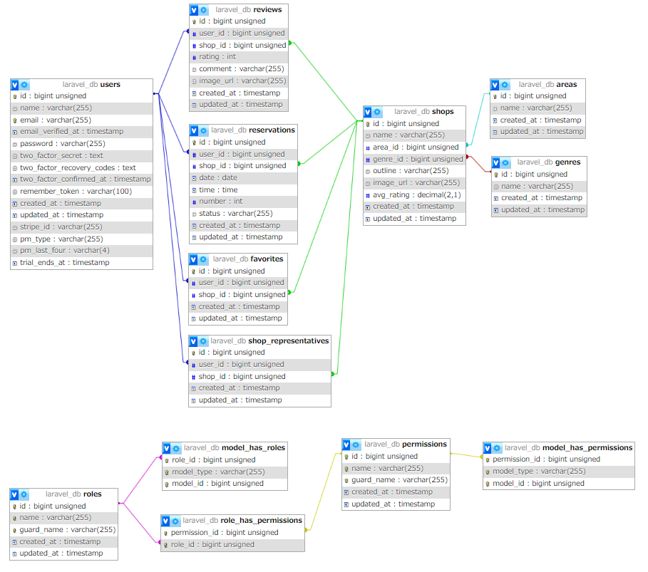

<p align="center"><a href="https://laravel.com" target="_blank"></a></p>

<p align="center">
<a href="https://travis-ci.org/laravel/framework"></a>
<a href="https://packagist.org/packages/laravel/framework"></a>
<a href="https://packagist.org/packages/laravel/framework"></a>
<a href="https://packagist.org/packages/laravel/framework"></a>
</p>

# 飲食店予約システム
飲食店の予約システムを作成しました。ログイン後、店舗の予約やお気に入りを追加、レビューを投稿できます。  
また、管理者権限と店舗代表者権限でそれぞれできることを切り分けました。  
リマインドメールに添付されるQRコードは、店側で読み取ることで予約データが'来店'に更新されるようになります。  
決済機能はStripeを使い、取り入れてみた程度のものです。  


## 作成した目的
勉強のアウトプットとして作成しました。

## アプリケーションURL
http://13.114.30.21/ （※現在停止中）

## 機能一覧
ログイン機能、メール認証、お気に入り追加/削除、予約追加/変更、検索、並び替え、レビュー、リマインドメール送信、QRコードで予約認証、決済機能  
管理者権限で店舗代表者作成、ユーザー一覧閲覧、お知らせメール送信  
店舗代表者権限で店舗情報の作成/更新、予約確認/変更/削除  csvインポートで新規店舗追加

## 仕様技術
docker、Laravel 8.x、PHP 7.4、laravel-fortify、laravel-permission、Stripe、javascript

## テーブル設計及びER図


## 環境構築
### コマンドライン上
```
$ git clone https://github.com/bokazuya25/ReservationSystem_restaurant.git
```

```php
$ docker compose up -d --build
$ docker compose exec php bash
```
### PHPコンテナ内
```php
$ composer install
```

### src上
```php
$ cp .env.local .env
$ php artisan migrate --seed
```

### PHPコンテナ内
```php
$ php artisan key:generate
$ php artisan migrate --seed
```

### src上
```php
$ sudo chmod -R 775 storage
$ sudo chmod -R 775 bootstrap/cache
```

## ダミーデータの説明
### ユーザー一覧
1. 管理者　　　email: admin@admin.com
2. 店舗代表者　email: shop@shop.com　※"shop_id: 1"の代表者
3. ユーザー　　　email: test@test.com  

※パスワードは全て"password"でログインできます。

## 店舗の新規作成方法
### 店舗代表者が作成する
1. 管理者でログイン
2. "店舗代表者作成"で店舗代表者権限を持つユーザーを作成
3. 店舗代表者でログイン
4. 店舗情報の作成で作成する

### csvファイルをインポートして作成する
1. 管理者でログイン
2. 管理者専用ページの新規店舗追加
3. csvファイルを作成し、選択（[サンプルCSVファイル](img/csvインポート用.csv)）
4. インポートボタンをクリック


